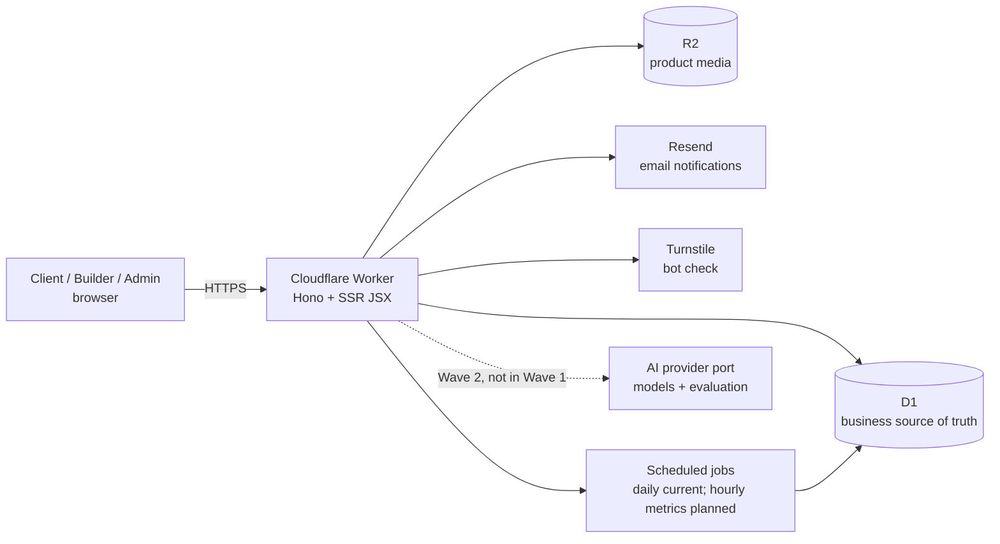

# VNX.SI — Whitepaper

**Version:** 0.1 
**Updated:** 2026-10-05 
**Scope:** product thesis, marketplace model, Wave 1 platform, architecture, trust model, and approved roadmap.

This paper describes what VNX.SI is designed to do and how it is being built. It separates capabilities already deployed, work merged into the main branch but not deployed, and later-stage plans. Targets and exit criteria are presented as targets, never as achieved results.

## 1. Executive summary

VNX.SI starts from a focused thesis: AI is making software faster and more accessible to build, while finding the right product, assessing what has actually been checked, meeting the right builder, and turning a need into a clear conversation remain difficult. VNX.SI is a marketplace for AI-built products and the people who build them.

A client can start with an existing product, ask a builder to customize it, hire that builder for a new project, or describe a need and request a shortlist. A builder gets a structured profile, a product catalogue, and a route from a public listing to a real inquiry instead of repeating the same presentation across disconnected channels.

Wave 1 focuses on supply: approved builders, structured product listings, searchable catalogue and directory, readable verification badges, Inquiry, and Post a request. Wave 1 does not process payments and does not include platform AI code. Those capabilities are intentionally deferred until the platform has enough real data and demand to justify them.

The operating principle is truth before growth. VNX.SI does not manufacture user counts, reviews, or testimonials. Organic ranking cannot be bought. If sponsored placement is introduced later, it must be a separate, clearly labelled area. These decisions are recorded in the [Product Charter](blueprint/01-PRODUCT-CHARTER.md), [ADR-004](adr/ADR-004-neutral-ranking.md), [ADR-007](adr/ADR-007-monetization.md), and [ADR-008](adr/ADR-008-sponsored-placement.md).

## 2. Scope and status

### 2.1 What this paper covers

This paper covers:

- the client, builder, and product model, including Buy / Customize / Hire / Build Similar;
- the current Builder Hub, product review, catalogue, Inquiry, and Post a request workflows;
- the trust layer, neutral ranking policy, privacy boundaries, and current security controls;
- the Wave 1 architecture, the boundary designed for Wave 2 AI, and the monetization foundation;
- measurable goals, constraints, risks, and the staged roadmap.

It is not a terms of service, privacy policy, uptime commitment, product warranty, or market-size report. See the [Terms](legal/terms.md), [Privacy Policy](legal/privacy.md), and [Disclosure](legal/disclosure.md) for those subjects.

### 2.2 Production, main, and planned work

The project status on 2026-10-05 is:

| Status layer | What is included | How to read it here |
|---|---|---|
| **Production** | Builder profiles and Hub, product editor and review, media, catalogue, builder directory, Inquiry, Post a request, and the related admin queues have been deployed. | These are the foundations for the current user journey, subject to each listing and service configuration. |
| **Merged into `main`, not deployed** | The EPIC 21 monetization/partner slice, including feature flags, merchants, offers, outbound links, and disclosure foundations, is merged but has not been deployed. | A route or module in the branch must not be read as a live partner, commission, or `/go/` capability. |
| **Design or roadmap** | Advanced metrics, platform AI, transaction/payment flows, sponsored placement, and scaled editorial content remain later phases. | These are conditional directions, without a promised release date. |

The internal [CURRENT-STATUS](../.ai/context/CURRENT-STATUS.md) file is the source for changing implementation status. When this paper says “current,” it refers to the deployed state above, not simply to code present in a working branch.

## 3. Product thesis

### 3.1 The problem

AI reduces the friction of building software, but clients still have to answer difficult questions:

- Is there already a product close to the need?
- Does a listing have a clear demo, price, licence, and support model?
- If changes are needed, who can make them?
- Which parts of a listing have been checked, and which still need the client’s own diligence?

Builders face the opposite problem. A useful product can be built once but remain hard to discover, hard to present consistently, and hard to connect to a concrete brief.

VNX.SI does not claim that a marketplace removes the risks of buying software. Its narrower thesis is that a structured catalogue, evidence-based trust signals, and direct inquiry can make the first step between a need and a builder more legible.

### 3.2 Design principles

1. **Truth before growth.** Every public number must be traceable to real data; social proof is never invented.
2. **Ranking is not for sale.** Partner commissions and monetization data cannot affect ranking, recommendations, or matching.
3. **Readable verification.** A badge states what was checked, when, and within what limits.
4. **Model agnostic.** Builders may use the AI tools that fit their work; the platform evaluates the product and delivery context.
5. **Compute before generation.** Future AI features will receive deterministic candidates and figures first; a model may explain or reorder only within that checked set.
6. **Privacy by default.** Builders do not receive a client’s email through the Inquiry or request flows, and unnecessary personal data is excluded from future AI prompts.
7. **Small operational surface.** Wave 1 favours one Worker, clear module boundaries, and a small set of managed services.
8. **International from the start.** The interface supports English, Vietnamese, Simplified Chinese, and Traditional Chinese.

## 4. Who VNX.SI serves

| Persona | Need | Intended value |
|---|---|---|
| **Small-business owner** | Software for a specific operation, often with a clear price and demo. | Search products by category, inspect a builder, and ask for a fit or a change. |
| **International or Chinese-speaking client** | Niche software and builders who can work in the right language. | Product and builder pages expose language, skills, and delivery context. |
| **Independent builder** | A way to distribute an existing product and receive customization work. | One public profile, product pages, Inquiry, and request invitations. |
| **Small studio** | A consistent way to present capability and receive suitable briefs. | Portfolio, products, availability, and a structured conversation channel. |
| **Owner / admin** | Review content, handle abuse, and match demand with oversight. | Queues, state transitions, audit records, and visible operating criteria. |

A client is represented by a user account. A builder is a role attached to a user and becomes public only after approval.

## 5. The Buy / Customize / Build model

Every product opens four paths. “Build” is currently expressed as hiring a builder for a new brief or starting from a similar product; payments and project management belong to Wave 3.

| Path | When it fits | Current route |
|---|---|---|
| **Buy** | The client wants to use the product as described. | Inspect the product page and send a `buy` Inquiry; VNX.SI does not process payment. |
| **Customize** | The product is close but needs changes to fit a business. | Available when the builder marks the product as customizable; send a `customize` Inquiry. |
| **Hire the builder** | The client wants the builder behind the product to do separate work. | Start a `hire` Inquiry from the product or builder page. |
| **Build Similar** | The client wants the same underlying idea adapted to a different context. | Start a `build_similar` Inquiry and continue the discussion on the web. |

At this stage VNX.SI is a discovery and connection layer. The client and builder remain responsible for checking the final scope, licence, price, delivery, and agreement.

## 6. Current workflows

### 6.1 Builder onboarding and profile

Builders sign in with a magic link sent by email. An invite link can take an applicant into the appropriate state, while a normal application enters the admin review queue. A profile can include a handle, name, builder type, headline, biography, country, skills, AI tools, working languages, availability, and any public contact details the builder chooses to provide.

Only an `approved` builder with an active user account appears on public pages. The Builder Hub supports a portfolio of up to 12 items. The AI tools a builder lists describe their working process; they are not an automatic quality certification.

### 6.2 Product creation and review

In the Builder Hub, a builder creates a draft and completes Product, Problem, Target users, Features, Demo, Pricing, Customization, Licence, and Support sections. A product can be a SaaS, source-code, or service offering. It can have up to five pricing tiers, and media is checked for file type, size, and quantity.

When its required fields are complete, the builder submits the product to the `in_review` queue. An admin can publish it, request changes with a review note, suspend it, or remove it from the catalogue. A non-public product is treated as absent on public routes.

Changing a demo URL after verification revokes the Demo verified badge. This keeps the evidence attached to the destination that was actually checked rather than treating a badge as permanent.

### 6.3 Client discovery

The `/products` catalogue supports search, category, delivery model, starting-price range, badge, and product-language filters, with pagination. The `/builders` directory filters by skill, category, language, country, and availability. A product page shows the problem, audience, features, technology context, pricing tiers, licence, customization, support, active badges, and builder.

Product and builder pages lead to the appropriate Inquiry form. The client’s email is not exposed to the builder through that exchange.

### 6.4 Inquiry: a direct web conversation

Inquiry is the current route for asking about a product or builder:

1. The client chooses `buy`, `customize`, `hire`, or `build_similar`, then provides a message, budget range, and optional deadline.
2. A signed-in client creates an `open` Inquiry; the builder receives a notification and both sides continue in the web inbox.
3. A signed-out client provides an email, passes Turnstile and honeypot checks, and receives a confirmation link. An implicit account may be created; the Inquiry opens after confirmation.
4. Email is used for notification and a return link. Replies belong in the web thread.
5. The client’s name, message, budget range, and deadline are available to the builder as needed for the conversation; the client’s email is not.

Origin checks, rate limits, email confirmation, and retryable notification handling reduce abuse and operational mistakes. They do not certify that every Inquiry is a good fit or that every builder will respond.

### 6.5 Post a request: when the catalogue is not enough

When a client cannot find a suitable product or builder, they can submit a private request with a title, description, category, budget range, deadline, and working languages.

1. A signed-out client confirms an email; a signed-in client submits directly.
2. The confirmed request enters the admin queue. An admin reviews it and can invite up to five builders using the published matching rules.
3. An invited builder sees the request in the Hub, not the client’s email, and can send an approach, price or price range, and expected timeline, or decline.
4. The client reviews proposals in `/me` and selects one. The request moves to `builder_selected`, and the system creates a `request` Inquiry whose first message contains the request and proposal.
5. The two parties continue through the normal Inquiry flow. Unanswered invitations expire according to the request state machine.

Requests are not a public message board. Admin matching is the current human-in-the-loop workflow; AI matching is a Wave 2 design after there is enough real outcome data.

### 6.6 Admin, audit, and state transitions

Admins review builders and products, handle Inquiry and request queues, grant or revoke badges, issue builder invites, suspend accounts when required, and process feedback. Domain rules govern state transitions. Important concurrent actions use compare-and-set and batches, and state changes are audited. Failed notifications remain eligible for retry instead of being treated as proof of delivery.

Audit records make decisions reviewable; they do not turn an administrative action into a warranty for a product.

## 7. Trust signals: what the badges mean

VNX.SI uses readable badges rather than stars or scores it cannot substantiate. Active badges appear with their verification date. Admin evidence and revocation reasons are retained for badges that require a manual check.

| Badge | What VNX.SI checked | What it does not mean |
|---|---|---|
| **Listed** | The VNX.SI team reviewed the listing for a clear description, real pricing or a clear way to request pricing, and working links before publication. | A warranty, security review, revenue certification, or proof that the product fits a particular client. |
| **Demo verified** | The VNX.SI team opened the demo and saw it work over HTTPS at the time of review. A changed demo URL revokes the badge. | Comprehensive testing, uptime, performance, security review, or a guarantee that the demo remains unchanged. |
| **In production** | The builder provided evidence of real customers using the product, and the VNX.SI team checked that evidence. | Verification of every customer, business outcome, deployment quality, security, or revenue. |

A product may have only Listed. Badges can be revoked when their evidence no longer applies. The [Terms](legal/terms.md) state that a badge means only what it says; no badge is an endorsement, warranty, or guarantee.

## 8. Neutral ranking and monetization boundaries

The catalogue uses search and filters. The builder directory places builders with `open` availability first, then considers published-product count and join time under the published rules. Trending, Top, and recommendation blocks are shown only when their data meets the relevant thresholds; a block without enough evidence is hidden or replaced.

No parameter, column, or code path may accept payment to change the order of the catalogue, directory, Trending, Top lists, or request matching. Merchant, offer, commission, and revenue data belong to the separate monetization module; ranking code cannot read them. This rule is defined by [ADR-004](adr/ADR-004-neutral-ranking.md) and [ADR-007](adr/ADR-007-monetization.md).

Sponsored placement is a post-Wave 1 possibility, not a current production feature. If enabled, it must be a separate, clearly labelled “Sponsored” slot, must not be mixed into organic results, and must not change organic order, as specified by [ADR-008](adr/ADR-008-sponsored-placement.md).

## 9. Architecture

Wave 1 uses a single Cloudflare Worker to keep the operational surface small and data boundaries explicit. Hono receives requests, renders JSX on the server, and handles form posts. D1 is the business source of truth; R2 stores media; Resend sends email; Turnstile supports public-form abuse controls.

The deployed daily job handles reminders, expiry, cleanup, and notification retries. An hourly public-stats and trending job is part of the M7 plan and is not presented as a current production capability.

### 9.1 Module boundaries

Modules share one Worker but own their data. `identity` owns users, sessions, tokens, rate limits, and audit. `builder` owns profiles, portfolios, and invites. `catalog` owns products, pricing, media, badges, and search. `engagement` owns Inquiry. `matching` owns requests and invitations. `notification` owns email delivery. `admin` coordinates those modules without owning their business state. `monetization` and `content` are separate modules for their later phases.

The `domain` layer contains pure rules and does not know Hono or D1. The `db` layer queries the tables it owns. Views render prepared props rather than querying storage. Architecture tests check these boundaries and the rule that ranking cannot depend on money.

### 9.2 Request lifecycle and data

A request passes through request ID, locale, session, origin checks, validation, rate limiting, a domain transition, D1 and audit writes, notification, and an HTML response or redirect. IDs use ULIDs, monetary values use USD cents where a price is present, and timestamps use ISO-8601 UTC. Migrations are additive and are not edited after production use.

State machines keep transitions such as `draft → in_review → published`, `pending_verification → open`, and `submitted → matching → builder_selected` explicit. Proposal selection and request closure use batches and compare-and-set guards so a losing concurrent action does not create a second outcome.

## 10. AI boundary for Wave 2

Wave 1 contains no platform AI code. “AI-built” describes how a builder may have made a product; it does not mean VNX.SI currently generates software for a client.

Wave 2 is designed around Discovery, Solution options, Builder matching, Estimate, Listing assistant, and Moderation. Each capability will pass through an access and budget gate, deterministic data tools, minimal context assembly, a provider port, schema validation, grounding, safety and language checks, and an audit record.

A model may not invent a product or builder outside the candidate set returned by the data tools. Price figures must come from real data. Each result should retain package version, model, data timestamp, and warnings. Client email, full names, and contact details must not enter a prompt. Matching begins in shadow mode so an admin remains the decision maker; automation requires the defined evaluation thresholds.

The design is documented in [AI Architecture](architecture/AI-ARCHITECTURE.md) and depends on ADR-005/006 decisions that remain future work.

## 11. Privacy and security

Current controls include:

- magic links and sessions stored as hashes, with a protected `__Host-` session cookie;
- origin checks for data-changing requests and D1-backed rate limits;
- Turnstile and honeypot checks for public forms when the user is signed out;
- plain-text handling and JSX escaping for user content, plus file-type, size, and count checks for uploads;
- audit records for important admin actions and state transitions, with request IDs in error logs;
- no client email exposed to builders through Inquiry or request, and no public request page;
- no payment details collected in Wave 1 and no third-party analytics/tracking cookies under the current policy.

These controls reduce risk but do not make any system perfectly secure. Cloudflare, Resend, and other service providers operate within their own roles and policies. When a user leaves VNX.SI through an external link, the destination’s policy applies. The [Privacy Policy](legal/privacy.md) covers data categories, retention, and user rights.

## 12. Monetization: current foundation and future phases

### 12.1 Current foundation

Current production does not process payments, and no live partner capability is claimed. The founding-phase product direction describes listings as free while the platform builds initial supply; that is a phase policy, not a permanent pricing promise.

The EPIC 21 monetization/partner foundation is merged into `main` but has not been deployed. It includes feature flags, merchants, offers, outbound links, disclosure, and conversion/revenue boundaries. Merge status does not replace operational, legal, or partner-term checks before production activation.

### 12.2 Designed phases

- Demo, website, and partner links may use a controlled route that validates destination hosts and records the appropriate disclosure.
- A click is not revenue. Conversions require a verified source, and the ledger is append-only.
- A partner link must disclose the relationship beside the link and on the disclosure page; commission cannot enter ranking or matching.
- Sponsored placement, if introduced after Wave 1, is a separate labelled slot with unchanged organic order.
- Wave 3 is the point at which orders, projects, milestones, payments, payouts, reviews, and maintenance are considered.

The purpose of this separation is to let VNX.SI explore sustainable revenue without turning money into a quality signal or a display-order signal.

## 13. Roadmap

The roadmap is a set of gates, not a promised calendar.

| Stage | Direction | Gate or constraint |
|---|---|---|
| **Wave 1 — Supply** | Builder profiles, products, catalogue, directory, badges, Inquiry, and human-led request matching. | The design uses roughly 100 published products as a gate before broader demand work; this is a target, not a current count. |
| **M7/M8 — Measurement and readiness** | Thresholded public stats, data-led homepage work, accessibility, translation review, security review, and a production runbook. | Every public number must be traceable to data; release readiness remains separate from product claims. |
| **Wave 2 — Demand + AI** | Discovery, three Buy / Customize / Build options, estimates, AI matching, listing assistance, moderation, and SEO content. | Requires real leads, evaluation results, and a controlled AI budget; early matching keeps an admin in the loop. |
| **Wave 3 — Transaction** | Projects, proposals, milestones, orders, payments/payouts, reviews, and maintenance. | Requires real transaction demand and suitable legal and operational foundations. |
| **Wave 4 — Idea to market** | Public Request a Product, Product Opportunity, and agent-assisted building. | No schedule is committed; it depends on liquidity and the earlier waves. |

Monetization and editorial content have their own phases and gates rather than being assumed as default Wave 1 features.

## 14. Success measures

The following are measures to be read from system data. They are not claims about current results.

| Area | Target measures |
|---|---|
| Supply | Approved builders; published products by category and badge. |
| Connection | Open Inquiry volume; builder response within three days; requests with at least one proposal; requests with a selected builder. |
| Discovery | Movement from product view to Inquiry or request; search usefulness; categories with insufficient supply. |
| Trust | Badge evidence and verification dates; badge revocations when evidence changes; no paid ranking signal. |
| Future AI | Precision@5 and recall against rule-based matching; valid schema and locale; cost and latency per capability. These are evaluation gates, not achieved scores. |
| Operations | Email failures, queue handling time, scheduled-job failures, security incidents, and cases requiring investigation. |

When data is below a threshold, the interface should hide the block or state that there is not enough data. The performance values in [NFR](blueprint/02-NFR.md) remain proposed targets, not SLAs.

## 15. Risks and limitations

- **Cold start:** a small supply makes the catalogue thin. Hiding low-confidence statistics may make the page look quieter, but avoids manufactured momentum.
- **Listing quality:** review and badges cover only the evidence described. Clients still need to inspect the demo, licence, price, and terms.
- **Human matching:** admins are a bottleneck as request volume grows; AI matching is deferred until outcome data exists.
- **No payment or dispute system:** VNX.SI currently has no escrow, payout, or platform dispute process for a client–builder agreement.
- **External services:** sign-in, confirmation, and notification depend on service configuration and delivery providers.
- **Security exposure:** rate limits, validation, audit, and deployment review reduce risk but cannot remove configuration, implementation, or provider failures.
- **Language coverage:** four interface locales do not imply that every product or piece of editorial content is translated.
- **Monetization governance:** partner terms, disclosure, conversion rules, and legal structure require separate review before activation; clicks cannot be treated as revenue.
- **Responsibility:** the product, licence, price, and delivery agreement remains between client and builder. Legal documents should be reviewed by qualified counsel before being relied upon for a particular situation.

## 16. Closing view

VNX.SI starts with a deliberately small marketplace: structured supply, readable trust signals, and a clear path from product discovery to a human conversation. Product pages, badges, Inquiry, and request matching are the bridge from “I need software” to “I know what I am asking for and who I am asking.” More complex capabilities — AI matching, payments, large-scale content, and monetization — should expand only when the data, evaluation, and operating model can preserve that standard of clarity.

## 17. References

- [Product Charter](blueprint/01-PRODUCT-CHARTER.md)
- [Module Map](blueprint/02-MODULE-MAP.md)
- [Domain Catalog](blueprint/03-DOMAIN-CATALOG.md)
- [System Architecture](architecture/ARCHITECTURE.md)
- [AI Architecture](architecture/AI-ARCHITECTURE.md)
- [Wave 1 Design Spec](superpowers/specs/2026-10-03-vnxsi-marketplace-wave1-design.md)
- [Marketplace OS v1 strategy](strategy/2026-10-03-marketplace-os-v1.md)
- [Wave 1 Roadmap](roadmap/WAVE1-ROADMAP.md)
- [ADR-004 — Neutral ranking](adr/ADR-004-neutral-ranking.md)
- [ADR-007 — Monetization boundary](adr/ADR-007-monetization.md)
- [ADR-008 — Sponsored placement](adr/ADR-008-sponsored-placement.md)
- [Privacy](legal/privacy.md), [Terms](legal/terms.md), and [Disclosure](legal/disclosure.md)

Explore the current marketplace at [https://vnx.si](https://vnx.si). For privacy, partnership, or whitepaper questions, contact [contact@vnx.si](mailto:contact@vnx.si).
